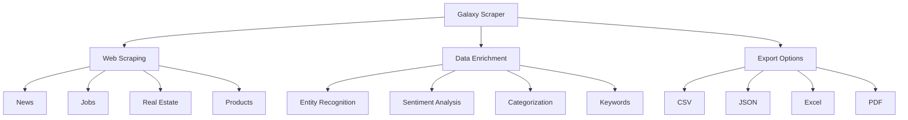

<!-- Title -->
<p align="center">
  
</p>

<p align="center">
  
  
  
  
  
</p>

<h1 align="center">🌌 Galaxy Scraper</h1>
<h3 align="center">AI-Powered Web Data Extraction & Enrichment Tool</h3>

<p align="center">
  <a href="#features">Features</a> •
  <a href="#demo">Demo</a> •
  <a href="#installation">Installation</a> •
  <a href="#subscription-tiers">Subscription Tiers</a> •
  <a href="#tech-stack">Tech Stack</a> •
  <a href="#environment-variables">Environment Variables</a>
</p>

## Overview

Galaxy Scraper is a powerful web data extraction tool enhanced with AI capabilities to provide valuable insights from scraped data. With tiered subscription access, users can extract, analyze, and export data from various websites with just a few clicks.

## Features

### 🕸️ Intelligent Web Scraping
- Multiple data type support (News, Jobs, Products, Real Estate)
- Smart extraction of structured data
- Customizable scraping parameters
- Visual data previews by type

### 🧠 AI-Powered Data Enrichment
- **Entity Recognition**: Automatically identify people, organizations, locations, and more
- **Sentiment Analysis**: Determine the emotional tone of content
- **Content Categorization**: Classify data into relevant topics
- **Keyword Extraction**: Identify important terms (Enterprise tier)
- **Summary Generation**: Create concise overviews (Enterprise tier)
- **Relationship Mapping**: Show connections between entities (Enterprise tier)

### 💼 Business-Ready Features
- **Multi-format Export**: Download data as CSV, JSON, Excel, or PDF
- **Subscription Management**: Tiered access with Stripe integration
- **User Authentication**: Secure Firebase authentication
- **Data Visualization**: Interactive charts and insights

## Subscription Tiers

### Free/Basic
- 5 items per enrichment request
- Basic entity and sentiment analysis
- CSV export only

### Pro
- 50 items per enrichment request
- Access to entity recognition, sentiment analysis, categorization, and keywords
- All export formats

### Enterprise
- Unlimited items per request
- Full access to all enrichment features
- Priority support
- Advanced analytics

## Tech Stack

- Next.js 15
- React 19
- TypeScript
- Tailwind CSS
- Firebase (Authentication, Firestore)
- Stripe (Payment processing)
- Radix UI (Component library)

## Key Features Visualization



## Subscription Tiers Comparison

| Feature | Free/Basic | Pro | Enterprise |
|---------|------------|-----|------------|
| Items per request | 5 | 50 | Unlimited |
| Entity Recognition | ✅ | ✅ | ✅ |
| Sentiment Analysis | ✅ | ✅ | ✅ |
| Categorization | ❌ | ✅ | ✅ |
| Keywords | ❌ | ✅ | ✅ |
| Summaries | ❌ | ❌ | ✅ |
| Relationship Mapping | ❌ | ❌ | ✅ |
| Export Formats | CSV only | All formats | All formats |
| Priority Support | ❌ | ❌ | ✅ |

## Installation

```bash
# Clone the repository
git clone https://github.com/Patrickscott999/Galaxy_Scraper.git

# Navigate to the project directory
cd Galaxy_Scraper

# Install dependencies
npm install

# Set up environment variables (see below)

# Run the development server
npm run dev
```

## Environment Variables

Create a `.env.local` file in the root directory with the following variables:

```
# Firebase Configuration
NEXT_PUBLIC_FIREBASE_API_KEY=your_api_key
NEXT_PUBLIC_FIREBASE_AUTH_DOMAIN=your_auth_domain
NEXT_PUBLIC_FIREBASE_PROJECT_ID=your_project_id
NEXT_PUBLIC_FIREBASE_STORAGE_BUCKET=your_storage_bucket
NEXT_PUBLIC_FIREBASE_MESSAGING_SENDER_ID=your_messaging_sender_id
NEXT_PUBLIC_FIREBASE_APP_ID=your_app_id

# Stripe Configuration
NEXT_PUBLIC_STRIPE_PUBLISHABLE_KEY=your_publishable_key
STRIPE_SECRET_KEY=your_secret_key

# OpenAI (for Data Enrichment)
OPENAI_API_KEY=your_openai_api_key
```

## Deployment

### Deploy to Vercel

This application is optimized for deployment on Vercel:

1. Push your code to GitHub
2. Import your repository in the [Vercel Dashboard](https://vercel.com/new)
3. Set the required environment variables
4. Deploy!

Alternatively, use the Vercel CLI:

```bash
npm install -g vercel
vercel login
vercel
```

### Important Deployment Notes

- Make sure to set all environment variables in your Vercel project settings
- Configure Stripe webhooks for production
- Ensure Firebase security rules are properly configured

## Project Structure

```
/app                   # Next.js app directory
  /api                 # API routes
    /create-payment-intent  # Stripe payment intent API
    /enrich            # Data enrichment API endpoint
    /scrape            # Web scraping endpoint
  /auth                # Authentication pages
  /dashboard           # Dashboard page (protected)
  /scraper             # Main scraping interface
  /subscriptions       # Subscription management
  
/components            # React components
  /auth                # Authentication components
  /data-enrichment-panel  # AI enrichment interface
  /data-type-previews  # Data type preview cards
  /export-options      # Multi-format export UI
  /tier-limit-indicator # Subscription tier limits display

/lib                   # Utilities and helpers
  /utils               # Utility functions
    /export-utils.ts   # Data export functionality
```

## License

This project is licensed under the MIT License.

## Acknowledgements

- [OpenAI](https://openai.com/) - For the AI enrichment capabilities
- [Next.js](https://nextjs.org/) - The React framework used
- [Tailwind CSS](https://tailwindcss.com/) - For styling
- [Firebase](https://firebase.google.com/) - Authentication and database
- [Stripe](https://stripe.com/) - Payment processing

---

<p align="center">
  <a href="https://github.com/Patrickscott999/Galaxy_Scraper/issues">Report Bug</a> •
  <a href="https://github.com/Patrickscott999/Galaxy_Scraper/issues">Request Feature</a>
</p>

<p align="center">
  Made with ❤️ by <a href="https://github.com/Patrickscott999">Patrick Scott</a>
</p>
  /payment             # Payment components
  /ui                  # UI components
  
/lib                   # Utility functions and services
  firebase.ts          # Firebase configuration
  authContext.tsx      # Authentication context
  stripe.ts            # Stripe configuration
```

## Usage

- Visit `/` to see the home page
- Go to `/auth/login` to log in
- Go to `/auth/signup` to create a new account
- After authentication, you'll be redirected to `/dashboard`

## Development Notes

- The application includes fallbacks for when Firebase and Stripe credentials are not configured, allowing for development without actual API keys.
- The UI is built with Tailwind CSS and Radix UI components for a modern and responsive design.
- Authentication is handled through Firebase Authentication.
- Payment processing uses Stripe's Elements and Payment Intents API.

## License

MIT
